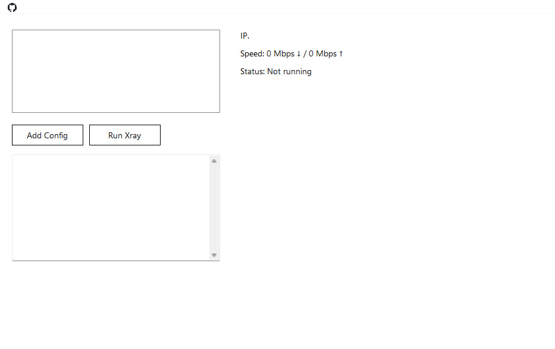

# Xray Launcher

🎯 A lightweight Windows GUI launcher for [Xray-core](https://github.com/XTLS/Xray-core), designed for simplicity, autonomy, and full system integration — no external scripts, no dependencies.

🎯 یک لانچر سبک برای ویندوز جهت اجرای [Xray-core](https://github.com/XTLS/Xray-core)، طراحی شده برای سادگی، استقلال کامل و یکپارچگی با سیستم — بدون اسکریپت‌های خارجی و بدون وابستگی.

---

## ✨ Features | ویژگی‌ها

- ✅ Embedded **Xray-core v25.12.8** inside the app  
- ✅ Built on **.NET Framework 4.8**  
- ✅ Config list management with persistent storage (`configs.txt`)  
- ✅ One-click proxy activation/deactivation via Windows registry  
- ✅ System tray icon with quick actions  
- ✅ Modern UI: borderless form, rounded corners, drag support  
- ✅ Displays public IP, connection status, and simulated speed  
- ✅ Cleans up temporary files and restores internet on exit  

- ✅ هسته‌ی **Xray-core v25.12.8** به صورت ZIP داخل نرم‌افزار قرار داده شده  
- ✅ ساخته‌شده بر پایه‌ی **.NET Framework 4.8**  
- ✅ مدیریت لیست کانفیگ‌ها با ذخیره‌سازی دائمی (`configs.txt`)  
- ✅ فعال‌سازی/غیرفعال‌سازی پروکسی تنها با یک کلیک از طریق رجیستری ویندوز  
- ✅ آیکون Tray با دسترسی سریع به گزینه‌ها  
- ✅ رابط کاربری مدرن: فرم بدون قاب، گوشه‌های گرد، قابلیت Drag  
- ✅ نمایش IP عمومی، وضعیت اتصال و سرعت شبیه‌سازی‌شده  
- ✅ پاک‌سازی فایل‌های موقت و بازگرداندن اینترنت به حالت اولیه هنگام خروج  

---

## 📦 Installation | نصب

**English:**  
1. Clone or download this repository.  
2. Open the solution in **Visual Studio**.  
3. Add the following resources:  
   - `Xray_windows_64.zip` → embedded as `Properties.Resources.Xray_windows_64`  
   - `github.png` → embedded as `Properties.Resources.github`  
   - `icon.ico` → placed in the executable directory  
4. Build and run the project.  

**فارسی:**  
1. این ریپازیتوری را کلون یا دانلود کنید.  
2. پروژه را در **Visual Studio** باز کنید.  
3. منابع زیر را اضافه کنید:  
   - `Xray_windows_64.zip` → به صورت Resource با نام `Properties.Resources.Xray_windows_64`  
   - `github.png` → به صورت Resource با نام `Properties.Resources.github`  
   - `icon.ico` → در کنار فایل اجرایی قرار دهید  
4. پروژه را بیلد و اجرا کنید.  

---

## 🖥️ Usage | نحوه استفاده

**English:**  
1. Launch the app.  
2. Click **Add Config** to select your `.json` configuration file.  
3. Click **Run Xray** to start the proxy.  
4. The button will change to **Stop Xray** — click again to deactivate and restore system settings.  
5. Use the tray icon for quick access: Start, Enable Proxy, Disable Proxy, Exit.  

**فارسی:**  
1. نرم‌افزار را اجرا کنید.  
2. روی **Add Config** کلیک کنید و فایل کانفیگ `.json` را انتخاب کنید.  
3. روی **Run Xray** کلیک کنید تا پروکسی فعال شود.  
4. دکمه به **Stop Xray** تغییر می‌کند — دوباره کلیک کنید تا پروکسی غیرفعال و تنظیمات سیستم بازگردانده شود.  
5. از آیکون Tray برای دسترسی سریع استفاده کنید: Start، Enable Proxy، Disable Proxy، Exit.  

---

## 📸 Screenshot | تصویر نمونه

---

## ⚙️ How It Works | نحوه عملکرد

**English:**  
- On launch, the embedded ZIP (Xray-core v25.12.8) is extracted to `%TEMP%\xray_core`  
- The selected config is passed to `xray.exe` via `-config` argument  
- Proxy settings are applied via registry:  
  - `ProxyEnable = 1`  
  - `ProxyServer = 127.0.0.1:10808`  
- On exit: proxy disabled, Xray process killed, temporary files deleted  

**فارسی:**  
- هنگام اجرا، فایل ZIP داخلی (Xray-core v25.12.8) در مسیر `%TEMP%\xray_core` استخراج می‌شود  
- کانفیگ انتخاب‌شده با آرگومان `-config` به `xray.exe` داده می‌شود  
- تنظیمات پروکسی از طریق رجیستری اعمال می‌شوند:  
  - `ProxyEnable = 1`  
  - `ProxyServer = 127.0.0.1:10808`  
- هنگام خروج: پروکسی غیرفعال، پروسه Xray بسته و فایل‌های موقت پاک می‌شوند  

---

## 🧠 Developer Notes | یادداشت‌های توسعه‌دهنده

- Built on **.NET Framework 4.8**  
- All logic is self-contained in `Form1.cs`  
- No external batch files or shell scripts  
- Uses `System.IO.Compression.ZipFile` for extraction  
- Uses `System.Net.WebClient` to fetch public IP  
- Uses `Microsoft.Win32.Registry` for proxy control  

- ساخته‌شده بر پایه‌ی **.NET Framework 4.8**  
- تمام منطق در فایل `Form1.cs` قرار دارد  
- بدون نیاز به فایل‌های Batch یا اسکریپت خارجی  
- استفاده از `System.IO.Compression.ZipFile` برای استخراج  
- استفاده از `System.Net.WebClient` برای گرفتن IP عمومی  
- استفاده از `Microsoft.Win32.Registry` برای کنترل پروکسی  

---

## 📄 License | مجوز

**English:**  
This project is licensed under the MIT License.  
You are free to use, modify, and distribute it.  

**فارسی:**  
این پروژه تحت مجوز MIT منتشر شده است.  
شما آزادید از آن استفاده کنید، تغییر دهید و منتشر کنید.  

---

## 🙌 Credits | سازندگان

- [Xray-core](https://github.com/XTLS/Xray-core)  
- [Milad Rezanezhad](https://github.com/miladrezanezhad) — Developer  

